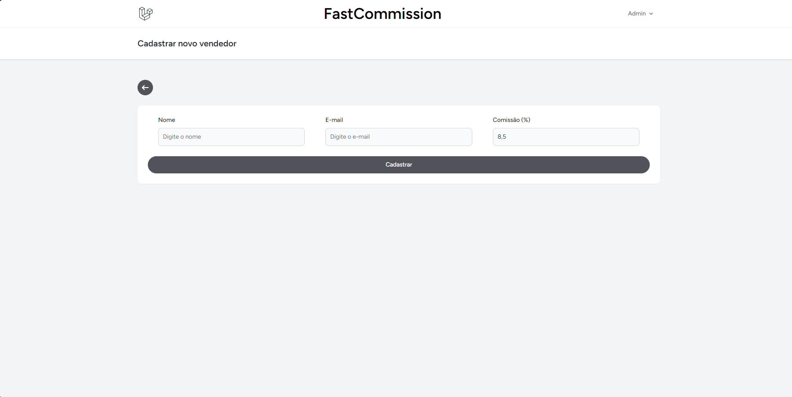
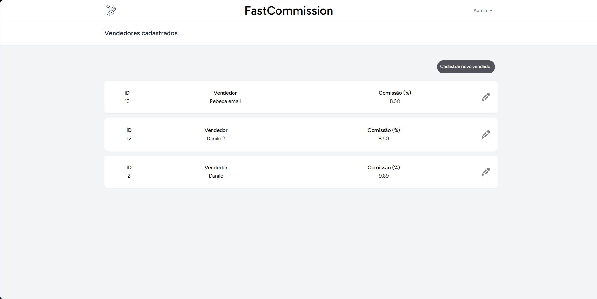
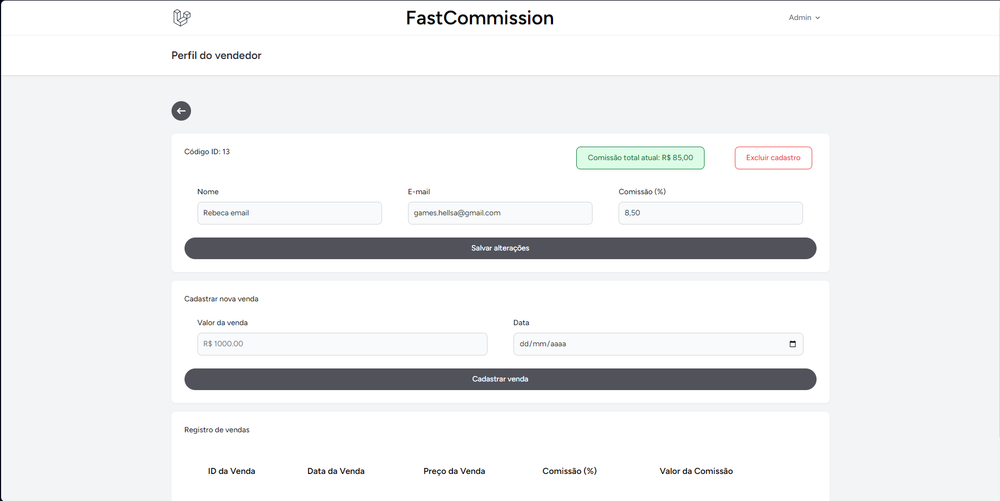
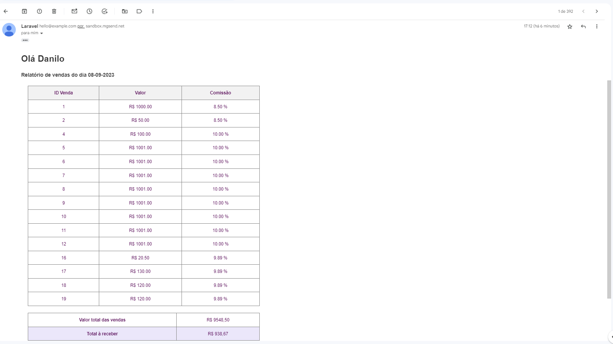

<h3 align="center">
    
</h3>

# Descrição do projeto

FastCommission é uma aplicação que permite que o vendedor usuário possa se cadastrar ou ser cadastrado pelo usuário administrador e consiga realizar o cadastro das suas vendas, registrando valor, data e comissão com base na comissão atrelada ao usuário.

O usuário administrador poderá ainda cadastrar vendedores, editar, listar e excluir, incluir ou excluir vendas para cada vendedor.

A aplicação também está configurada para realizar envios de e-mails diariamente ao final do dia, contendo um relatório de todas as vendas registradas no dia por aquele vendedor, o valor total das vendas e o valor total da comissão sobre as vendas.

Este projeto foi desenvolvido como requisito para o processo seletivo de Pessoa Desenvolvedora PHP Junior na TRAY.

<h4 align="center"> 
	🚀 Projeto finalizado 🚀
</h4>

# Layout do projeto

<p align="center">
  

  
 
  

  
</p>

# Pré-requisitos

Antes de começar a utilizar o FastCommission, certifique-se de atender aos seguintes requisitos:

### Ambiente de desenvolvimento:

-   PHP: O projeto foi desenvolvido usando PHP na versão 8.2.4. Certifique-se de ter o PHP instalado em seu ambiente. Você pode verificar a versão instalada com o comando php -v.

-   XAMPP: Recomendado o uso do XAMPP na versão 1.4.11 ou superior para configurar o servidor web e banco de dados local. Você pode baixar o XAMPP em https://www.apachefriends.org/index.html.

-   Composer: Você precisará do Composer na versão 2.6.2 ou superior para gerenciar as dependências do PHP. Você pode instalá-lo seguindo as instruções em https://getcomposer.org/download/.

-   Node.js: A aplicação utiliza Node.js na versão v18.16.1 ou superior. Certifique-se de ter o Node.js instalado em seu sistema. Você pode verificar a versão com o comando node -v.

-   Breeze: O projeto utiliza o Breeze para a instalação das dependências do frontend. Após instalar o Node.js, execute o seguinte comando para configurar o frontend: npm install && npm run dev.

### Configuração do Banco de Dados

Antes de executar a aplicação, configure a conexão com o banco de dados no arquivo .env localizado na raiz do projeto. Exemplo de configuração:

```bash
DB_CONNECTION=mysql
DB_HOST=127.0.0.1
DB_PORT=3306
DB_DATABASE=fastcomission
DB_USERNAME=root
DB_PASSWORD=
```

### Configuração para envio dos e-mails

A aplicação utiliza o serviço MailGun para o envio de e-mails.O serviço possui um cadastro gratuito para utilização e você poderá configurar a conexão com o MailGun no arquivo .env. Exemplo de configuração:

```bash
MAIL_MAILER=mailgun
MAIL_HOST=smtp.mailgun.org
MAILGUN_DOMAIN= seu domínio aqui
MAILGUN_SECRET= chave API aqui
MAIL_FROM_ADDRESS="fastcommission@app.com"
MAIL_FROM_NAME="${APP_NAME}"
```
Ajuste também a configuração para execução das filas de acordo com sua preferência, exemplo com uso do banco de dados local:

```bash
QUEUE_CONNECTION=database
```

### Instalação das dependências

```bash
composer install
```
Depois:
```bash
npm install
```

### Execução das Migrations

Execute as migrações do banco de dados para criar as tabelas necessárias (não esqueça de iniciar o banco de dados antes):

```bash
php artisan migrate
```

### Alimentação do Banco de Dados com o usuário Admin

```bash
php artisan db:seed --class=AdminUserSeeder
```

Usuário administrador padrão:

E-mail: admin@admin.com

Senha: admin123

Por padrão, o sistema criará os usuários Vendedores com a senha "trocar123", caso queira acessar um Vendedor criado, basta usar a senha citada.

### Starte e projeto

Em terminais diferentes rode:
```bash
php artisan serve
```

```bash
npm run dev
```

### Configuração da CRON

Para agendar o envio diário de e-mails, o projeto utiliza o Laravel Scheduler. O agendamento padrão envia os e-mails diariamente ao final do dia. No entanto, se desejar realizar o envio instantâneo, siga estas instruções:

1. Abra o arquivo App\Console\Kernel.php.

2. Altere a linha:

```bash
$schedule->job(new SendDaylyEmailsJob())->dailyAt('00:00');
```

Para:

```bash
$schedule->job(new SendDaylyEmailsJob())->everyMinute();
```

Execute o seguinte comando para iniciar a execução do Job:

```bash
php artisan schedule:work
```

Após o primeiro enviom poderá parar a execução. Não se esqueça de incluir o e-mail receptor no MailGun ou o host utilizado para que o envio seja bem suscedido.

Agora o FastCommission está configurado e pronto para ser usado 🚀

### Tecnologias utilizadas

As seguintes ferramentas foram usadas na construção do projeto:

-   [Laravel](https://laravel.com)
-   [PHP](https://nodejs.org/en/)
-   [MySQL](https://pt-br.reactjs.org/)
-   [Tailwind](https://reactnative.dev/)

Feito com ❤️ por Rebeca Bertolini 👋🏽 [Entre em contato!](https://www.linkedin.com/in/rebeca-bertolini-spósito-544048200/)
